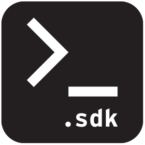

## ⚠️ Beta v0.1.0 ⚠️

### Pre-requisites

The following tools should be installed locally:

- AEM SDK + WKND Reference site running locally at https://localhost:4502
- Node 12 or above https://nodejs.org/
- Yarn https://yarnpkg.com/getting-started/install

### Instructions

☝️ Open a new terminal window and run the following command to clone the StoryStore SDK

`git clone https://github.com/PMET-public/storystore-sdk.git`

`cd storystore-sdk`

✌️  Install dependencies:

`yarn install`

✨ Run StoryStore SDK:

`yarn wknd:sdk`

__4.__ The experience will be available at:
  - **WKND Adventures (Your Demo Web App)**: http://localhost:3000
  - **UIKit (Development Canvas)**: http://localhost:6006
